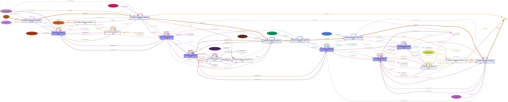
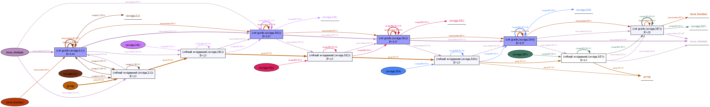

# Case Study Summary

This document presents the key results from the case study conducted as part of the paper *Advancing Object-Centric Process Mining with Multi-Dimensional Data Operations*. The findings highlight significant improvements in process model fitness and precision when applying the proposed multi-dimensional data operations.


The precision and fitness were calculated for 71 (out of 91) groups. We encountered timeouts when calculating these measures for 20 groups, half of which belonged to 2023. Observing the OC-DFG for 2023 reveals a less structured process compared to other years, leading to more complex process models. This complexity made the OC-Petri net models too intricate for calculating precision and fitness measures. 

The high fluctuation in 2023 stems from a significant change in that year: the introduction of a new track, "Green BPM," and the decision to make the "Process Mining" track optional. This choice led to a less structured process, adding complexity as students followed different tracks. In 2024, this change was revoked, restoring a more structured learning path.

To provide a more detailed understanding of the process, we visualized the OC-DFG process models discovered for each year before and after transformation.

---

## OC-DFGs Discovered for Different Years

### 2021
Here is the OC-DFG filtered to capture only "set grade" and "submit assignment," involving three filtered objects: user, group, and assignment.


Here is the OC-DFG based on the drilled-down and unfolded log that enabled the discovery of the previous OC-DFG:



---

### 2022
Here is the OC-DFG filtered to capture only "set grade" and "submit assignment," involving three filtered objects: user, group, and assignment.


Here is the OC-DFG based on the drilled-down and unfolded log that enabled the discovery of the previous OC-DFG:


---

### 2023
Here is the OC-DFG filtered to capture only "set grade" and "submit assignment," involving three filtered objects: user, group, and assignment.


Here is the OC-DFG based on the drilled-down and unfolded log that enabled the discovery of the previous OC-DFG:


---

### 2024
Here is the OC-DFG filtered to capture only "set grade" and "submit assignment," involving three filtered objects: user, group, and assignment.


Here is the OC-DFG based on the drilled-down and unfolded log that enabled the discovery of the previous OC-DFG:



---

## Lowest Fitness

We investigated two groups with the lowest fitness after drilling down and unfolding, both of which belonged to 2024. In these two groups, we observed a high degree of member turnover. This graph was manually altered from the tEKG to color relations differently for demonstration purposes.


Here is also some information about the tEKG we exported for 2014:

The schema is visualized here:


The types of nodes and relations and the count of each elements are listed below:


```sql
// Retrieve node types and counts
MATCH (n)
UNWIND labels(n) AS Label
RETURN Label AS Type, COUNT(*) AS Count, 'Node' AS ElementType
UNION
// Retrieve relationship types and counts
MATCH ()-[r]->()
RETURN type(r) AS Type, 'Relationship' AS ElementType, COUNT(*) AS Count
ORDER BY ElementType, Count DESC;
```

```csv
Type,ElementType,Count
LOG,Node,1
CLASS,Node,8
EVENT,Node,38313
ENTITY,Node,2426
SNAPSHOT,Node,2307
CORR,Relationship,3822311
DF,Relationship,180799
HAS,Relationship,38313
OBSERVED,Relationship,38313
DERIVED,Relationship,4074
REL,Relationship,2037
SNAPSHOT,Relationship,1348
```

---

## Conclusion

The case study results underscore the effectiveness of incorporating multi-dimensional data operations into Object-Centric Process Mining. The ability to dynamically adjust the level of detail provides deeper insights into process execution and enhances model quality.
